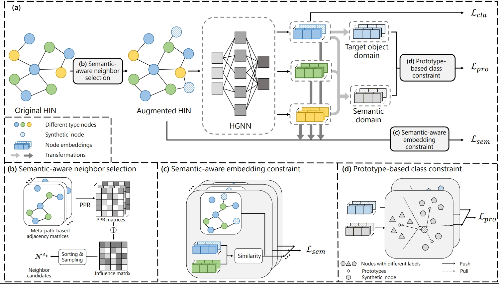

## Introduction

This repository is the implementation of CIKM'23 paper: Semantic-aware Node Synthesis for Imbalanced Heterogeneous Information Networks. 

\



## Requirements

All experiments are implemented in Python 3.9 with Pytorch 1.11.0.

To install requirements:
```setup
pip install -r requirements.txt
```

## Data

The datasets used in our experiments are download from the repository of [SHGP](https://arxiv.org/abs/2210.10462) ([github](https://github.com/kepsail/SHGP)).Please download the dataset and place it in the folder `./data`. The code of dataset processing for imbalanced setting is provided in `./scr/load_data.py`, and use `--im_ratio` to change the imbalance scenario.


## Model training

To train the model and execute the SNS under `im_ratio=0.1`:

```bash
$ cd ./scr
$ bash ./run.sh
```
For the HGT model, please use the model in [DGL](https://github.com/dmlc/dgl/tree/master/examples/pytorch/hgt) and convert the graphs using `dgl.heterograph`.
